# VSDSquadron-Mini-Intership

## TASK 1 

### Compilation of C program Using GCC Compiler and RISC-V Compiler
- Install Leafpad using command ``` sudo snap install leafpad ``` , If it's not preinstalled in your device.


- Now open Leafpad using Command ``` leafpad Sum1ton.c & ``` and Write C Program which is given Below.

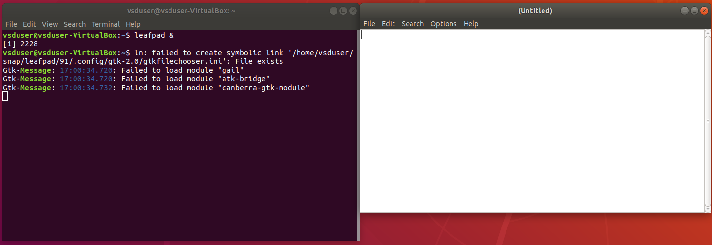

```CPP
#include<stdio.h>

int main(){
    int i, sum=0, n = 5;
    for (i=1; i <= n; ++i){
        sum += i;
    }
    printf("Sum of Numbers From 1 to %d is %d\n", n, sum);
    return 0;
}
```
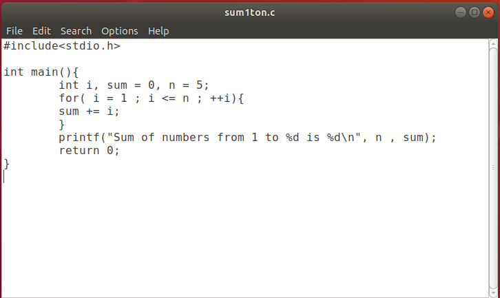

- This C program will give the sum of the number from 1 to n.
- Now for Compiling C program using GCC compiler write Command ``` gcc Sum1ton.c ``` and for executing this compiled program use ``` ./a.out ```.

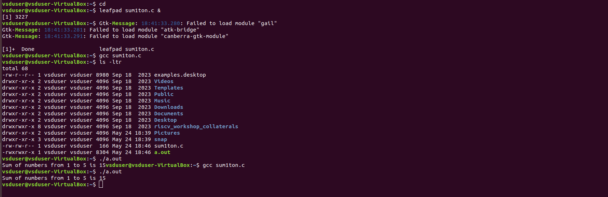

- Change the value of n. e.g. n = 100

```CPP
#include<stdio.h>

int main(){
    int i, sum=0, n = 100;
    for (i=1; i <= n; ++i){
        sum += i;
    }
    printf("Sum of Numbers From 1 to %d is %d\n", n, sum);
    return 0;
}
```


#### Now let's compile this same program using RISC-V compiler :-

- Use below mentioned command for translating C program ``` Sum1ton.c ``` into an object File ```Sum1ton.o```

``` riscv64-unknown-elf-gcc -O1 -mabi=lp64 -march=rv64i -o Sum1ton.o Sum1ton.c ```

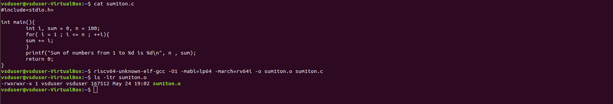

- Now for observing the assembly language instruction use command ``` riscv64-unknown-elf-objdump -d sum1ton.o | less ```
- It will open the below mentioned Instruction.

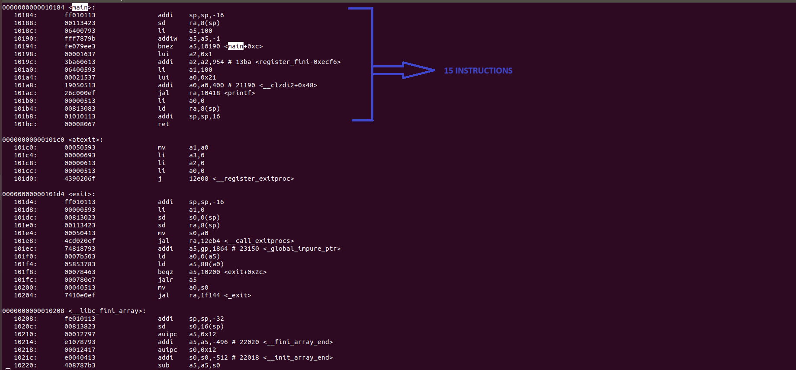

- If we calculate number of instruction, It will be the 
<b> 15 Instruction</b>.

- Now doing let's modify the optimization flag from ``` -O1 ``` to ```-Ofast``` and observe the changes in number of instruction.

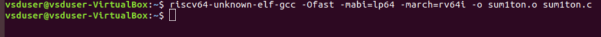

``` riscv64-unknown-elf-gcc -Ofast -mabi=lp64 -march=rv64i -o Sum1ton.o Sum1ton.c ```

- Reapting the same process for observing the output.

``` riscv64-unknown-elf-objdump -d sum1ton.o | less ```

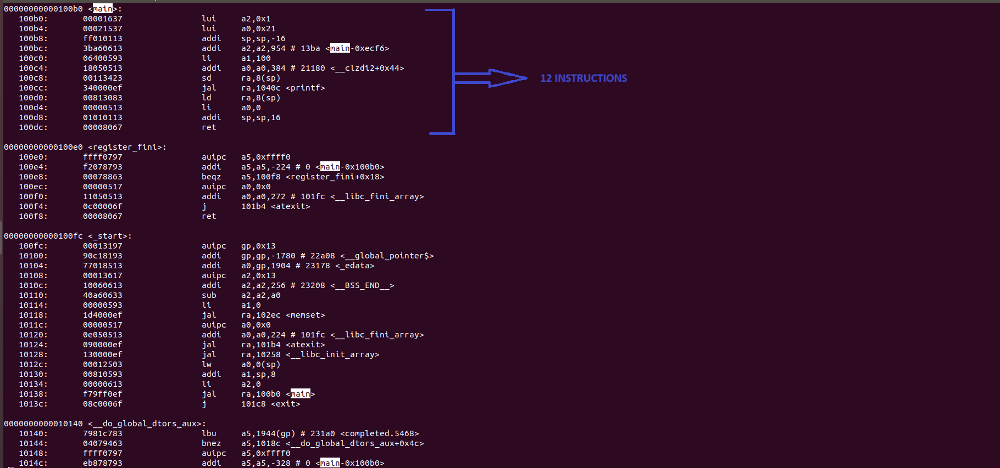

- So after using ```-Ofast ``` our instruction is reduce by 12 Instructions.
- Therefore we can say that the number of instructions are different for ``` -O1 ``` and ``` -Ofast ```.

---

## TASK 2

### UNDERSTANDING THE RISC-V AND IT'S INSTRUCTION SET


### RISC-V: Definition and Description

**Definition:**
RISC-V (Reduced Instruction Set Computer V) is an open standard instruction set architecture (ISA) that is designed to be scalable and flexible. It was developed by the University of California, Berkeley, and is freely available under open-source licenses. Unlike proprietary ISAs, RISC-V is designed to be free for anyone to use, enabling broad adoption and fostering innovation in hardware and software development.

**Description:**
RISC-V is a highly modular ISA, consisting of a small base set of instructions and multiple optional extensions. This modularity allows for customization based on the specific needs of different applications, ranging from small embedded systems to powerful supercomputers.

*Key Features of RISC-V:*
- *Open Standard:* RISC-V is not owned by any single company, ensuring long-term stability and freedom from licensing fees.
- *Simplicity:* The base ISA includes a minimal set of instructions, which simplifies the design and verification of hardware.
- *Extensibility:* Numerous standard extensions are available (e.g., for floating-point operations, atomic instructions, vector processing), and custom extensions can be added as needed.
- *Scalability:* RISC-V can be implemented in various sizes and configurations, making it suitable for a wide range of computing devices.
- *Ecosystem Support:* A growing community of developers and companies supports a rich ecosystem of tools, software, and hardware implementations.

### Detailed Description of Instructions

*R-Type Instructions:*
R-Type instructions perform operations between registers. They follow the format:
```
[opcode (7 bits)][rd (5 bits)][funct3 (3 bits)][rs1 (5 bits)][rs2 (5 bits)][funct7 (7 bits)]
```

- *ADD:* Adds the values in two registers and stores the result in a destination register.
- *SUB:* Subtracts the value in the second register from the value in the first register and stores the result in a destination register.
- *AND:* Performs a bitwise AND between two registers and stores the result in a destination register.
- *OR:* Performs a bitwise OR between two registers and stores the result in a destination register.
- *XOR:* Performs a bitwise XOR between two registers and stores the result in a destination register.
- *SLT:* Sets the destination register to 1 if the first register is less than the second register, otherwise sets it to 0.
- *SRL:* Shifts the value in the first register to the right by the number of positions specified in the second register.
- *SLL:* Shifts the value in the first register to the left by the number of positions specified in the second register.

*I-Type Instructions:*
I-Type instructions involve an immediate value (a constant embedded in the instruction). They follow the format:
```
[opcode (7 bits)][rd (5 bits)][funct3 (3 bits)][rs1 (5 bits)][imm[11:0] (12 bits)]
```

- *ADDI:* Adds an immediate value to the value in a register and stores the result in a destination register.
- *LW:* Loads a word from memory into a register.

*S-Type Instructions:*
S-Type instructions store data from a register into memory. They follow the format:
```
[opcode (7 bits)][imm[4:0] (5 bits)][funct3 (3 bits)][rs1 (5 bits)][rs2 (5 bits)][imm[11:5] (7 bits)]
```
- *SW:* Stores the value in a register into memory.

*B-Type Instructions:*
B-Type instructions perform conditional branches. They follow the format:
```
[opcode (7 bits)][imm[11] (1 bit)][imm[4:1] (4 bits)][funct3 (3 bits)][rs1 (5 bits)][rs2 (5 bits)][imm[10:5] (6 bits)][imm[12] (1 bit)]
```
- *BNE:* Branches to a specified address if the values in two registers are not equal.
- *BEQ:* Branches to a specified address if the values in two registers are equal.

### Detailed 32-bit Instruction Codes with Descriptions

1. *ADD r6, r2, r1:*
   - *Definition:* Adds the values in r2 and r1, storing the result in r6.
   - *Format:* R-Type
   - *Binary Representation:*
     ```
     funct7: 0000000
     rs2:    00001
     rs1:    00010
     funct3: 000
     rd:     00110
     opcode: 0110011
     ```
   - *Hex:* 0x00210133

2. *SUB r7, r1, r2:*
   - *Definition:* Subtracts the value in r2 from r1, storing the result in r7.
   - *Format:* R-Type
   - *Binary Representation:*
     ```
     funct7: 0100000
     rs2:    00010
     rs1:    00001
     funct3: 000
     rd:     00111
     opcode: 0110011
     ```
   - *Hex:* 0x402080b3

3. *AND r8, r1, r3:*
   - *Definition:* Performs a bitwise AND between r1 and r3, storing the result in r8.
   - *Format:* R-Type
   - *Binary Representation:*
     ```
     funct7: 0000000
     rs2:    00011
     rs1:    00001
     funct3: 111
     rd:     01000
     opcode: 0110011
     ```
   - *Hex:* 0x0030c033

4. *OR r9, r2, r5:*
   - *Definition:* Performs a bitwise OR between r2 and r5, storing the result in r9.
   - *Format:* R-Type
   - *Binary Representation:*
     ```
     funct7: 0000000
     rs2:    00101
     rs1:    00010
     funct3: 110
     rd:     01001
     opcode: 0110011
     ```
   - *Hex:* 0x005141b3

5. *XOR r10, r1, r4:*
   - *Definition:* Performs a bitwise XOR between r1 and r4, storing the result in r10.
   - *Format:* R-Type
   - *Binary Representation:*
     ```
     funct7: 0000000
     rs2:    00100
     rs1:    00001
     funct3: 100
     rd:     01010
     opcode: 0110011
     
   - *Hex:* 0x0040a233

6. *SLT r11, r2, r4:*
   - *Definition:* Sets r11 to 1 if r2 is less than r4, otherwise sets it to 0.
   - *Format:* R-Type
   - *Binary Representation:*
     ```
     funct7: 0000000
     rs2:    00100
     rs1:    00010
     funct3: 010
     rd:     01011
     opcode: 0110011
     
   - *Hex:* 0x004152b3

7. *SRL r16, r14, r2:*
   - *Definition:* Shifts the value in r14 to the right by the number of positions in r2, storing the result in r16.
   - *Format:* R-Type
   - *Binary Representation:*
     ```
     funct7: 0000000
     rs2:    00010
     rs1:    01110
     funct3: 101
     rd:     10000
     opcode: 0110011
     
   - *Hex:* 0x00270333

8. *SLL r15, r1, r2:*
   - *Definition:* Shifts the value in r1 to the left by the number of positions in r2, storing the result in r15.
   - *Format:* R-Type
   - *Binary Representation:*
     ```
     funct7: 0000000
     rs2:    00010
     rs1:    00001
     funct3: 001
     rd:     01111
     opcode: 0110011
     
   - *Hex:* 0x002081b3

9. *ADDI r12, r4, 5:*
   - *Definition:* Adds the immediate value 5 to the value in r4, storing the result in r12.
   - *Format:* I-Type
   - *Binary Representation:*
     ```
     imm[11:0]: 000000000101
     rs1:       00100
     funct3:    000
     rd:        01100
     opcode:    0010011
     
   - *Hex:* 0x00522093

10. *LW r13, r1, 2:*
    - *Definition:* Loads a word from memory at the address formed by adding 2 to the value in r1, storing it in r13.
    - *Format:* I-Type
    - *Binary Representation:*
      ```
      imm[11:0]: 000000000010
      rs1:       00001
      funct3:    010
      rd:        01101
      opcode:    0000011
      
    - *Hex:* 0x0020a683

11. *SW r3, r1, 2:*
    - *Definition:* Stores the value in r3 into memory at the address formed by adding 2 to the value in r1.
    - *Format:* S-Type
    - *Binary Representation:*
      ```
      imm[11:5]: 0000000
      rs2:       00011
      rs1:       00001
      funct3:    010
      imm[4:0]:  00010
      opcode:    0100011
      
    - *Hex:* 0x00212023

12. *BNE r0, r1, 20:*
    - *Definition:* Branches to the address offset 20 if the values in r0 and r1 are not equal.
    - *Format:* B-Type
    - *Binary Representation:*
      ```
      imm[12|10:5]: 000000
      rs2:         00001
      rs1:         00000
      funct3:      001
      imm[4:1|11]: 01000
      opcode:      1100011
      
    - *Hex:* 0x01408063

13. *BEQ r0, r0, 15:*
    - *Definition:* Branches to the address offset 15 if the values in r0 and r0 are equal.
    - *Format:* B-Type
    - *Binary Representation:*
      ```
      imm[12|10:5]: 00000
      rs2:         00000
      rs1:         00000
      funct3:      000
      imm[4:1|11]: 01111
      opcode:      1100011
      
    - *Hex:* 0x00f00063
    
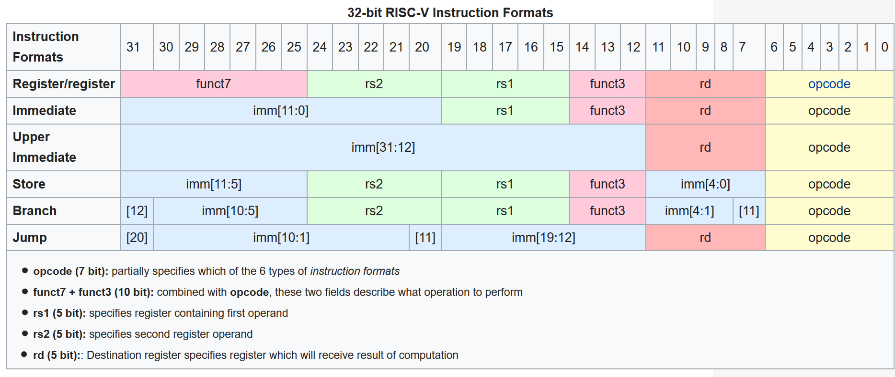


### Summary of Instruction Codes

Here's a consolidated list of the instruction codes along with their binary representation and hexadecimal equivalents:

| Instruction | Binary Representation | Hexadecimal |
|-------------|-----------------------|-------------|
| *ADD r6, r2, r1* | 0000000 00001 00010 000 00110 0110011 | 0x00210133 |
| *SUB r7, r1, r2* | 0100000 00010 00001 000 00111 0110011 | 0x402080b3 |
| *AND r8, r1, r3* | 0000000 00011 00001 111 01000 0110011 | 0x0030c033 |
| *OR r9, r2, r5* | 0000000 00101 00010 110 01001 0110011 | 0x005141b3 |
| *XOR r10, r1, r4* | 0000000 00100 00001 100 01010 0110011 | 0x0040a233 |
| *SLT r11, r2, r4* | 0000000 00100 00010 010 01011 0110011 | 0x004152b3 |
| *SRL r16, r14, r2* | 0000000 00010 01110 101 10000 0110011 | 0x00270333 |
| *SLL r15, r1, r2* | 0000000 00010 00001 001 01111 0110011 | 0x002081b3 |
| *ADDI r12, r4, 5* | 000000000101 00100 000 01100 0010011 | 0x00522093 |
| *LW r13, r1, 2* | 000000000010 00001 010 01101 0000011 | 0x0020a683 |
| *SW r3, r1, 2* | 0000000 00011 00001 010 00010 0100011 | 0x00212023 |
| *BNE r0, r1, 20* | 0000000 10100 00000 001 01000 1100011 | 0x01408063 |
| *BEQ r0, r0, 15* | 0000000 01111 00000 000 01111 1100011 | 0x00f00063 |

---

## TASK 3

### FUNCTIONAL SIMULATION OF RISC-V INSTRUCTION SETS
-> REFERENCE :- https://github.com/vinayrayapati/rv32i
### ICARUS Verilog (iverilog)

*ICARUS Verilog (iverilog)* is an open-source Verilog simulation and synthesis tool, primarily used for digital logic design verification. Here are its key features and functionalities:

1. *Simulation:*
   - Icarus Verilog can compile and simulate Verilog HDL (Hardware Description Language) code.
   - It supports both Verilog-1995 and Verilog-2001 standards, making it versatile for different versions of Verilog code.
   - It allows users to simulate digital circuits to verify the correctness of their designs before moving to hardware implementation.

2. *Synthesis:*
   - While its primary strength is simulation, Icarus Verilog also offers synthesis capabilities. It can convert Verilog code into netlists, which describe the circuit in terms of logic gates and other hardware elements.
   - It integrates with other synthesis tools to enable a complete design flow from HDL to hardware.

3. *Compilation:*
   - Icarus Verilog compiles Verilog code into intermediate forms that can be executed or further processed.
   - The tool chain supports various intermediate formats, enabling integration with other tools and workflows.

4. *Extensibility:*
   - The open-source nature of Icarus Verilog means it can be extended and customized by users. This flexibility is particularly valuable for academic research and projects requiring specialized functionality.

5. *Cross-Platform:*
   - It runs on multiple operating systems, including Linux, macOS, and Windows, providing a versatile tool for different environments.

6. *Integration:*
   - Icarus Verilog can be integrated with other tools such as GTKWave for waveform viewing, and various testbench frameworks to streamline the design verification process.

### GTKWave

*GTKWave* is a fully featured GTK+ based waveform viewer for viewing VCD (Value Change Dump) files generated by simulation tools like Icarus Verilog. Key features include:

1. *Waveform Viewing:*
   - GTKWave allows users to view simulation results in a graphical format, which is essential for analyzing the behavior of digital circuits.
   - It supports multiple formats such as VCD, LXT, LXT2, and FST, providing flexibility in how simulation data is viewed.

2. *User Interface:*
   - The user interface is designed to be intuitive, with functionalities for zooming, panning, and searching through waveforms.
   - It includes features for bookmarking, grouping, and hierarchical viewing of signals, which helps in managing complex designs.

3. *Signal Display:*
   - GTKWave displays signal states over time, allowing designers to visually inspect how signals change during simulation.
   - It supports a variety of data types, including digital, analog, and multi-valued logic signals.

4. *Customization:*
   - Users can customize the display, including colors, fonts, and layout to suit their preferences.
   - Scripting capabilities enable automation of common tasks, enhancing productivity.

5. *Cross-Platform:*
   - Like Icarus Verilog, GTKWave is cross-platform and can be used on Linux, macOS, and Windows, making it accessible to a wide range of users.

6. *Integration:*
   - It integrates seamlessly with Icarus Verilog and other simulation tools, providing a comprehensive environment for digital design verification.

### Usage in a Design Flow

In a typical digital design verification flow, Icarus Verilog and GTKWave are used as follows:

1. *Coding:*
   - The designer writes Verilog HDL code to describe the digital circuit.

2. *Simulation:*
   - The Verilog code is compiled and simulated using Icarus Verilog. During simulation, a VCD file is generated, capturing all the signal changes over time.

3. *Viewing Results:*
   - The VCD file is opened in GTKWave, where the designer can visually inspect the waveforms to verify the correct behavior of the circuit.

4. *Debugging:*
   - Any discrepancies or errors observed in GTKWave can lead to further code modifications and iterative simulations until the design meets all specifications.


#### STEPS FOR OBSERVING WAVEFORM

- In Terminal apply below given command for installing iverilog.

``` sudo apt-get install iverilog gtkwave ```

TASK 3/T3I1.png

- After that clone the reference repository which contain the verilog netlist and testbench.

``` 
git clone https://github.com/vinayrayapati/rv32i
```
- Now for simulute the verilog code type below command.

 ``` 
 iverilog -o iiitb_rv32i iiitb_rv32i.v iiitb_rv32i_tb.v
 ```

- Now for observing waveform use ``` gtkwave iiitb_rv32i.vcd ```
- Now click on iiitb_rv32i, it will show rv32i file. Click on this file, you can see different signal option at left buttom side.
- Add require options and observe waveforms.

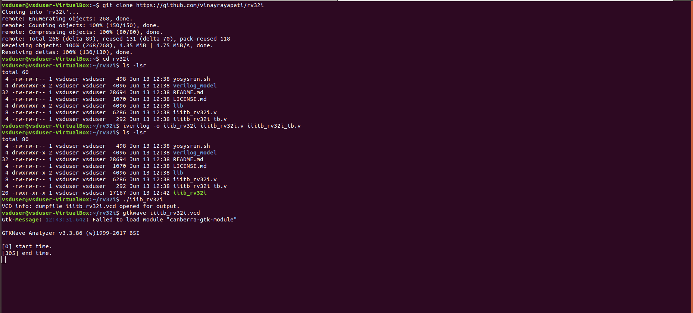

-> Observing Different RISC-V  Instruction :-
1. *ADD r6, r2, r1:*
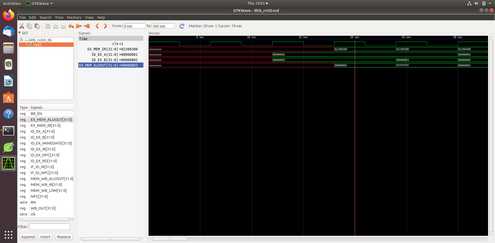
2. *SUB r7, r1, r2:*
 
3. *AND r8, r1, r3:*
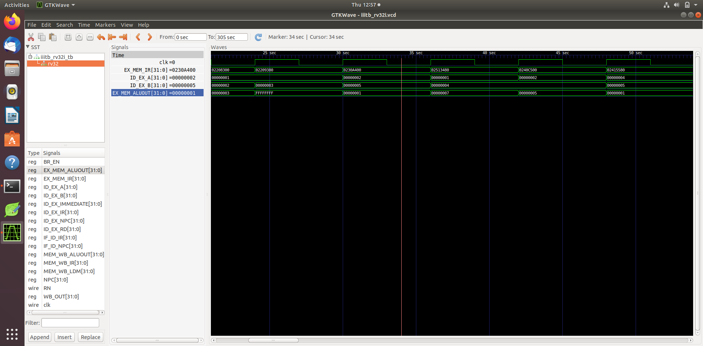
4. *OR r9, r2, r5:*

5. *XOR r10, r1, r4:*

6. *SLT r11, r2, r4:*

7. *ADDI r12, r4, 5:*
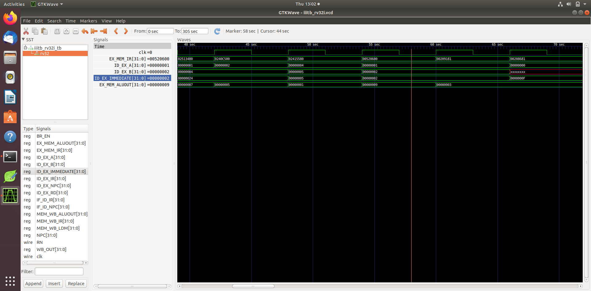
8. *SW r3, r1, 2:*
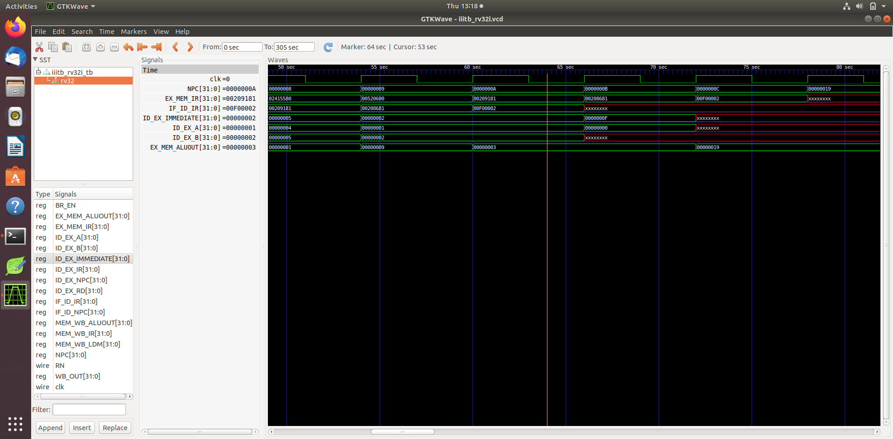
9. *LW r13, r1, 2:*
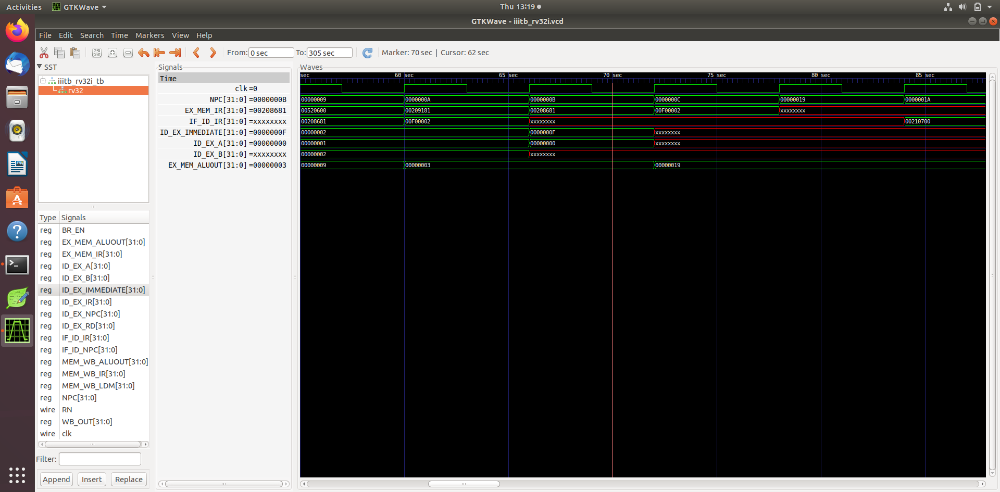
10. *BEQ r0, r0, 15:*
After Branching with ADD r14,r2,r2
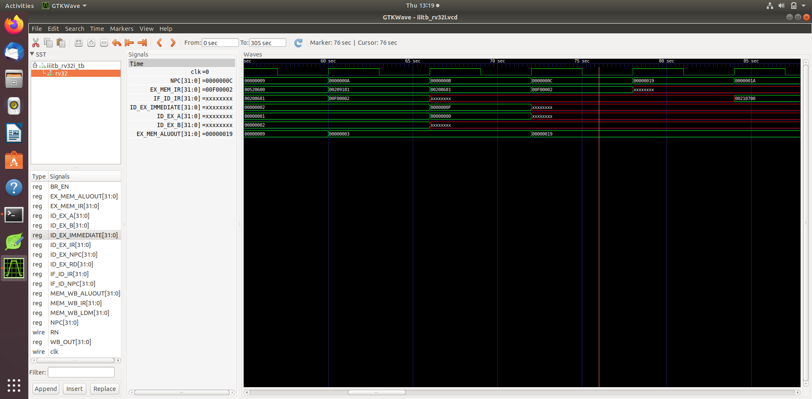


---

## TASK 4

### PROJECT WORK
### Project Documentation: 4-bit Parallel-In Serial-Out (PISO) Shift Register Implementation Using VSDSquadron Mini Board

#### 1. Project Overview

This project implements a 4-bit Parallel-In Serial-Out (PISO) shift register using the VSDSquadron Mini Board. The primary objective is to demonstrate the conversion of parallel data into serial data, which is essential for various digital communication and data storage applications.

#### 2. Definition

A Parallel-In Serial-Out (PISO) shift register is a type of digital circuit used to convert parallel data (multiple bits) into serial data (one bit at a time). This is particularly useful in applications where data needs to be transmitted over a single data line or stored sequentially.

#### 3. Application of PISO Shift Registers

PISO shift registers are widely used in:
- *Data Communication*: Sending multiple data bits over a single channel.
- *Microcontroller Interfaces*: Reducing the number of I/O pins required.
- *Serial Communication Protocols*: Implementing SPI, UART, and other protocols.
- *Data Storage*: Writing data to serial memory devices.

#### 4. Required Components

- *VSDSquadron Mini Board*: The microcontroller board used for implementation.
- *Breadboard*: A construction base for prototyping electronics.
- *Resistor*: Typically a 220Ω to 470Ω resistor to limit the current through the LED.
- *LED*: Light Emitting Diode for visual feedback.
- *Jumper Wires*: For making connections on the breadboard.

#### 5. CIRCUIT DIAGRAM


#### 6. Implementation Details

##### 6.1. Hardware Configuration

The GPIO pin PD4 on the VSDSquadron Mini Board is used to output the serial data. The pin is configured as a push-pull output to ensure proper signal levels. The LED is connected to PD4 through a current-limiting resistor on a breadboard.

##### 6.2. Software Implementation

The project code is written in C. Below is the code implementation:
``` cpp
#include <ch32v00x.h>
#define BIT0_PIN GPIO_Pin_4 // Bit 0 output (PD4)
#define GPIO_PORT GPIOD // GPIO port for the above pin
void Delay_Init(void);
void Delay_Ms(uint32_t n);
void GPIO_Config(void) {
    // Enable the clock for GPIOD
    RCC_APB2PeriphClockCmd(RCC_APB2Periph_GPIOD, ENABLE);
    // Configure PD4 as output
    GPIO_InitTypeDef GPIO_InitStructure;
    GPIO_InitStructure.GPIO_Pin = BIT0_PIN;
    GPIO_InitStructure.GPIO_Mode = GPIO_Mode_Out_PP; // Push-pull output
    GPIO_InitStructure.GPIO_Speed = GPIO_Speed_50MHz;
    GPIO_Init(GPIO_PORT, &GPIO_InitStructure);
}
void outputBit(uint8_t bit) {
    // Output a single bit to the GPIO pin
    if (bit & 0x01) {
        GPIO_SetBits(GPIO_PORT, BIT0_PIN);
    } else {
        GPIO_ResetBits(GPIO_PORT, BIT0_PIN);
    }
}
void outputPatternPISO(uint8_t data) {
    // Output the data serially, one bit at a time
    for (int i = 0; i < 4; i++) {
        uint8_t bit = (data >> i) & 0x01;
        outputBit(bit); // Output one bit at a time
        Delay_Ms(2000); // Delay for visualization
    }
}
int main() {
    SystemCoreClockUpdate();
    Delay_Init();

    // Initialize the GPIO for the output bits
    GPIO_Config();

    uint8_t patterns[] = {0b1111 , 0b0101 , 0b0000 };
    uint8_t pattern_count = sizeof(patterns) / sizeof(patterns[0]);
    uint8_t current_pattern = 0;

    while (1) {
        // Output the current pattern serially to the GPIO pin
        outputPatternPISO(patterns[current_pattern]);
        // Move to the next pattern
        current_pattern++;
        if (current_pattern >= pattern_count) {
            current_pattern = 0;
        }
        Delay_Ms(1000); // Delay for visualization
    }
    return 0;
}
```

##### 6.3. Explanation of Key Functions

- *GPIO_Config()*: Configures the GPIO pin (PD4) as a push-pull output.
- *outputBit(uint8_t bit)*: Outputs a single bit to the GPIO pin.
- *outputPatternPISO(uint8_t data)*: Outputs a 4-bit data pattern serially.
- *Delay_Ms(uint32_t ms)*: Provides a delay in milliseconds for visualization.

#### 7. Video Demonstration

<video controls src="VN20240613_161706.mp4" title="Title"></video>

The project cycles through a set of predefined 4-bit patterns (0b1111, 0b0101, 0b0000) and outputs each pattern bit-by-bit on the GPIO pin. Each bit is output with a 2-second delay for visualization. After outputting all 4 bits of a pattern, the system waits for 1 second before switching to the next pattern. 
```
In total, for the three patterns:
- 12 bits are transmitted, each taking 2 seconds, totaling 24 seconds.
- An additional 1-second delay occurs between patterns, totaling 3 seconds for three transitions.
```
Thus, the entire cycle of transmitting these patterns and switching between them takes 27 seconds. After completing one cycle, the system continuously repeats this process. This behavior is demonstrated in a video with a stopwatch for precise time tracking.

#### 8. Conclusion

This project provides a clear example of how to implement a PISO shift register using a microcontroller. By understanding the principles and implementation details, one can adapt and extend this project for various applications in digital communication and embedded systems.
